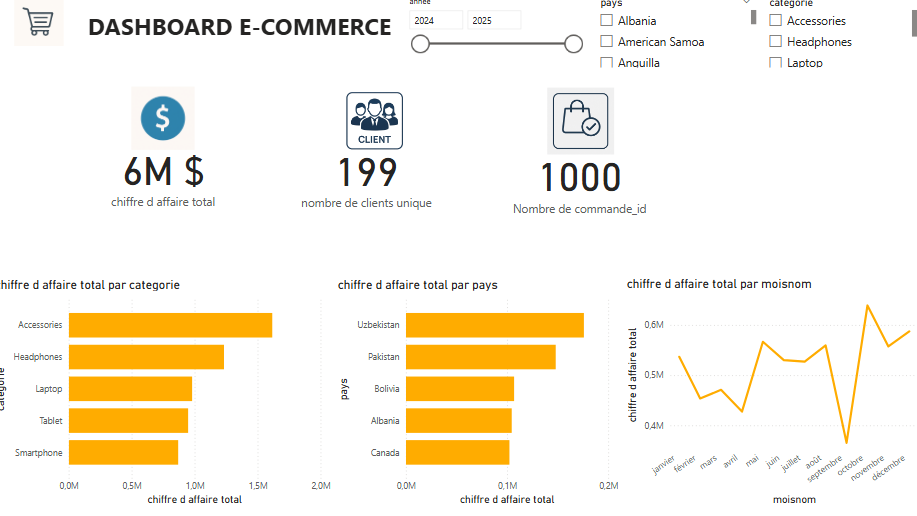

# 📊 Dashboard E-Commerce

Ce projet est un tableau de bord interactif de suivi des performances d’un site e-commerce. Il a été réalisé à partir de données de ventes comprenant les chiffres d’affaires par catégorie de produits, par pays et par mois.

## 📌 Aperçu



## 🔍 Fonctionnalités principales

- **Chiffre d'affaires total :** `6M $`
- **Nombre de clients uniques :** `199`
- **Nombre total de commandes :** `1000`
- **Filtrage dynamique :**
  - Par **année** (2024–2025)
  - Par **pays** (ex. : Albania, American Samoa…)
  - Par **catégorie de produit** (Accessories, Headphones, etc.)

## 📊 Visualisations incluses

- **Chiffre d'affaires total par catégorie**
  - Les produits "Accessories" dominent les ventes.
  - Suivis par "Headphones", "Laptop", "Tablet", et "Smartphone".

- **Chiffre d'affaires total par pays**
  - Le top 3 des pays : **Uzbekistan**, **Pakistan**, et **Bolivia**.

- **Chiffre d'affaires total par mois**
  - Pic de ventes en **octobre**, **décembre**, et **juillet**.
  - Mois plus faibles : **février** et **septembre**.

## 🛠 Technologies utilisées

- **Power BI / Excel / Tableau** (selon outil utilisé pour la visualisation)
- **Fichier d'entrée :** Données structurées avec colonnes telles que :
  - `moisnom`, `categorie`, `pays`, `commande_id`, `chiffre_affaire`, etc.

## 📂 Structure du dépôt

```
📦 dashboard-ecommerce
 ┣ 📁 images/
 ┃ ┗ 📄 dashboard_apercu.png.png
 ┣ 📄 README.md
 ┗ 📄 dashboard.pbix / dashboard.xlsx (à ajouter si applicable)
```

## 🚀 Instructions

1. Cloner le dépôt :
   ```bash
   git clone https://github.com/votre-utilisateur/dashboard-ecommerce.git
   ```

2. Ouvrir le fichier `.pbix` ou `.xlsx` dans Power BI / Excel / autre outil de BI.

3. Analyser et filtrer les données en fonction des besoins.

## 📈 Objectifs du projet

Ce projet a pour but de :

- Visualiser les performances commerciales par segment produit et géographique.
- Suivre les tendances mensuelles des ventes.
- Identifier les opportunités d'amélioration ou d'expansion géographique
